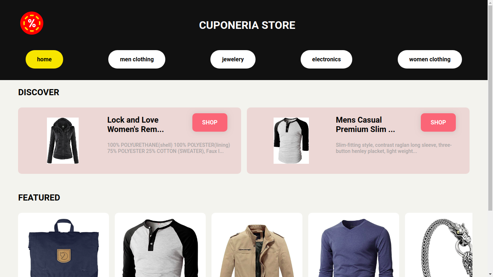
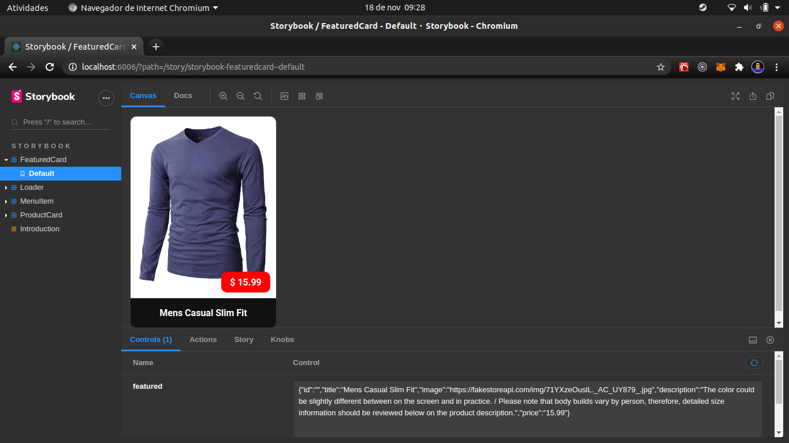
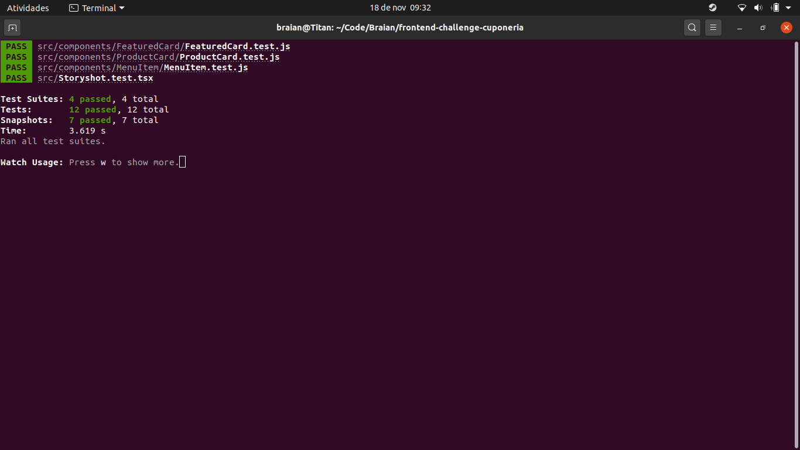
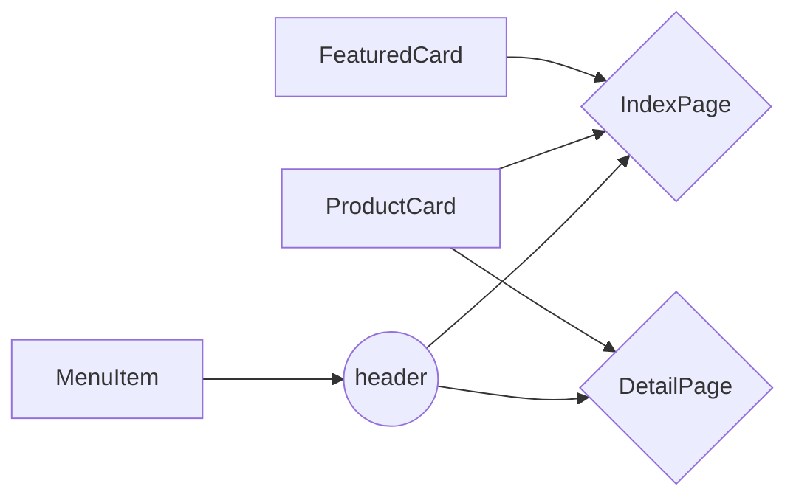

# Cuponeria Store for Frontend Challenge

Project developed for the frontend challenge using React.js with Typescript, consuming data from the api Fake Store, unit tests with Jest and demonstration of a design system and integration of tests with Storybook.


## Overview

The project was built trying to be as close and accurate to the request in the Figma file. For styling, CSS-in-JS was used with the styled-components, two pages were built, one for Index and one for Detail, and 3 main reusable components: FeaturedCard, ProductCard and MenuItem.

It was used for grid layout pages, and for components, flexbox layout. In another scope, tools would be used to prototype faster like the bootstrap, which in this case would be the reactrsap, or else material-ui or others.

<div style="display: flex">
    
</div>

## Getting Started

How to Install and Start
   -  Clone the project to your device with: ```git clone https://github.com/BraianMendes/frontend-challenge-cuponeria.git```
    -   Navigate into the repository with: ```cd frontend-challenge-cuponeria```
    -  Install the project's dependencies with your package manager preferably with: ``` npm install ``` or ``` yarn install```
    - Once installed, you can run the project in your development environment with: ``` npm start ``` or ``` yarn start```
    - The project will run at the door: http://localhost:3000/

How to test
   -  You can do unit tests of the project with: ```npm run test``` or ```yarn test```
    -   Inside your command terminal you can see Jest doing the tests and printing the results.

How open Storybook

   -  You can start the Storybook using: ```npm run storybook``` or ```yarn storybook```
    -   It will then generate a new Storybook-specific frontend where you can track and work with the components, at the door: http://localhost:6006/

## About Storybook

This tool is essential for the development of a design system for your project or groups of projects of the same entity. There you can view the rendering of each component, in some cases even their behavior within a page or between them. And yet it allows integration of unit tests, snapshot tests, visual tests and more, all integrated with the CI. Allowing: to monitor the evolution of components from commit to commit, how they interact with each other, possible variations and how to use them. It also allows a non-developer designer to follow the visual tests, monitor their approval within the CI, much more visual and friendly tests and a more complete control of their frontend applications.

In our exercise it was applied to the 3 main components: FeaturedCard, ProductCard and MenuItem. And it allows you to see its rendering and some variations of the components.

<div style="display: flex">
    
</div>

## About Testing

The tests can be of the most varied, guaranteeing the quality and correct execution of our code, in addition to improving maintenance and more.

In our exercise unit tests were applied through Jest, which is a JavaScript testing framework designed to ensure correctness of any JavaScript codebase.

It was used integrated with the Storybook, taking advantage of the components it renders and testing as a proof of concept without having gone into all its possibilities. Storybook snapshot tests have also been added.

With this integration it would be possible to do more in-depth CI using visual tests with tools already prepared for Storybook partners, and implement together our own unit tests and others.

<div style="display: flex">
    
</div>
## Components diagrams

Below you can follow the simple architecture used to orchestrate the components and views / pages.



## Final considerations

Thank you very much for watching so far and for the opportunity. I am open to all conversations, doubts and whatever else you want. I hope to see you in a new stage.